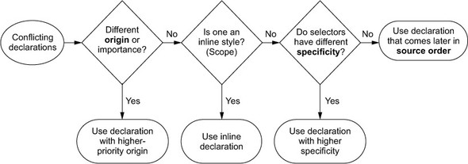
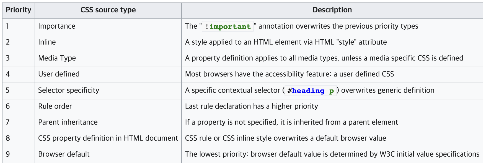
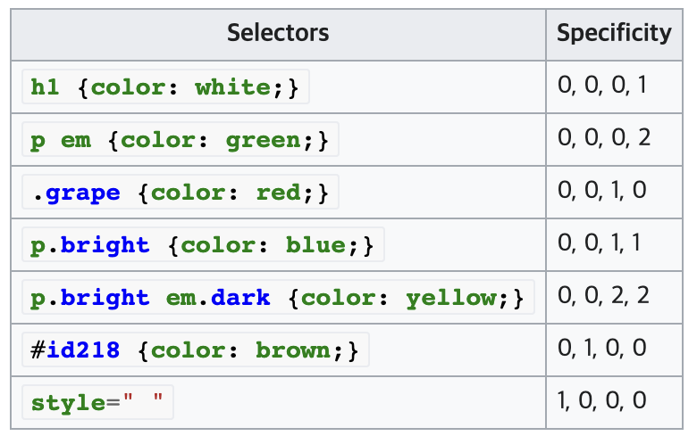

## Cascading Style Sheets (CSS)
[Wikipedia][1]
Javascript를 이용한 프론트엔드 개발에서 스타일을 넣기 위해 빠질 수 없는 요소
기본적으로 CSS에 관한 내용을 정리할 것이지만, SCSS를 추가하여 좀 더 편하게 정리할 수 있도록 하겠음

### 1. Selector
셀렉터는 어떤 element들에 스타일을 적용시킬 것인지를 결졍함
* 기본적으로 정의되어 있는 태그(div, p, input 등등)를 사용하는 element는 태그명을 사용
* Id attribute를 사용한 element에는 #[id명]의 형태를 사용
* Class attribute를 사용한 element에는 .[class명]의 형태를 사용

### 2. Pseudo-class
[MDN web docs][2]  
[TCPschool][3]  

의사클래스는 element의 상태에 따라 스타일을 적용하기 위해서 사용  
즉, 같은 element라고 하더라도 element의 상태에 따라 스타일을 다르게 적용시킬 수 있음  
선택자 뒤에 :[의사클래스명]를 붙여서 사용

의사클래스는 다음과 같은 종류가 있음

1. 동적 의사 클래스(dynamic pseudo-classes)
- :link / :visited
	- 링크에 한 번도 방문한 적이 없을 때 / 있을 때
- :hover
	- 마우스를 위에 올려놓고 있을 때
- :active
	- 마우스로 클릭하고 있을 때(마우스를 누르고 뗄 때까지)
- :focus
	- Input 등의 element가 선택된 상태일 때
	
2. 상태 의사 클래스(UI element states pseudo-classes)
- :checked
	- Input(radio, checkbox), option 등의 element에서 선택된 상태일 때 
- :enabled / disabled
	- 선택, 클릭, 입력 등이 가능한 element가 활성화 / 비활성화된 상태일 때

3. 구조 의사 클래스(structural pseudo-classes)
- :[first / last / nth / nth-last]-[child / of-type]
	- Element의 순서에 따라 결정
	- child의 경우 해당하는 순서의 child일 경우에만 적용
	
4. 기타 의사 클래스
- :not
	- 주어진 인수에 해당하지 않는 element에만 반대로 적용
- :lang
	- 언어에 따라 다르게 적용
	
### 3. Pseudo-element
[MDN web docs][4]  
의사요소는 원하는 요소의 일부분에만 스타일을 적용하기 위해 사용
선택자 뒤에 ::[의사요소명]의 형태로 사용
- ::before / ::after
	- 요소 처음 / 마지막에 원하는 내용을 추가하기 위해 사용
	- 주로 'content'프로퍼티와 함께 사용
- ::first-letter / ::first-line
	- 텍스트의 첫 번째 글자 / 줄에만 적용
- ::marker
	- 요소 li에 들어가는 marker의 스타일을 적용
	
### 4. Declaration block
CSS에서는 스타일을 [프로퍼티]:[값];의 형태로 나타냄
프로퍼티가 크기나 길이를 나타낼 경우, 0이 아닌 값에 대해서는 무조건 단위를 붙여야 함  
다음 7가지의 단위가 권장된다고 함
- ch: 현재 폰트 및 폰트 사이즈에서 '0'문자의 너비에 해당하는 단위 
- Q: 1/40 cm 
- rem: 루트 요소의 글꼴 크기
- vh, vw: 브라우저의 뷰포트의 1/100에 해당하는 단위
- vmin, vmax: 각각 vh/vw 중 작은 값, 큰 값

### 5. Cascading

둘 이상의 스타일이 있을 때, 어떤 스타일을 적용시킬지를 결정

* Priority

우선순위는 다음과 같음 
1. !important가 붙은 프로퍼티
2. Element 내에서 style 어트리뷰트로 적용한 스타일
3. 특정 media type의 css가 정의되어 있지 않으면 모든 media type에 적용
4. 사용자 정의 css (외부 css파일을 이용한 스타일?)
5. 셀렉터에 따른 specificity
6. 나중에 정의된 스타일이 덮어씌움
7. 정의된 프로퍼티가 없다면 부모의 값을 상속받음
8. Inline 스타일 (HTML 내에서 style 태그를 이용한 스타일?)
9. 브라우저 기본값

* Specificity

Priority 5번째 항목의 specificity는 셀렉터에 따라 결정됨  
위 표에서 specificity는 순서대로  
[style attribute 사용 유무], [id 유무], [class 개수], [element 개수]를 나타냄  
왼쪽부터 값이 클수록 우선순위가 높음
(style attribute 사용 유무는 priority의 2번 항목과 중복되는 것 같은데...)

[1]: https://en.wikipedia.org/wiki/CSS
[2]: https://developer.mozilla.org/ko/docs/Web/CSS/Pseudo-classes
[3]: http://www.tcpschool.com/css/css_selector_pseudoClass
[4]: https://developer.mozilla.org/ko/docs/Web/CSS/Pseudo-elements